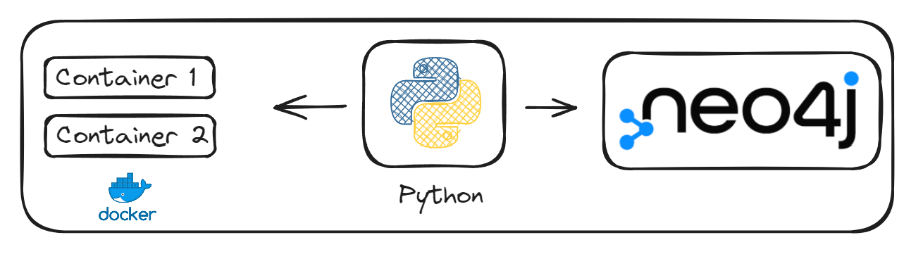
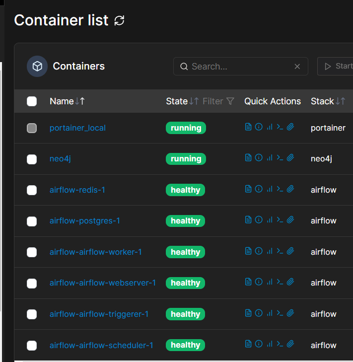
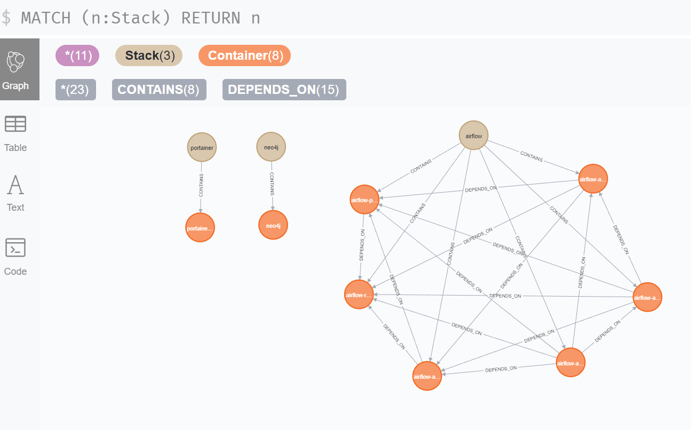

# Neo4j
Neo4j rodando no Docker.

O objetivo desse projeto é analisar graficamente a comunicação entre os microserviços Docker.

## Arquitetura


## Pré-requisitos
* Docker
* Python3.10 

## Como instalar o Docker?
https://www.youtube.com/playlist?list=PLbPvnlmz6e_L_3Zw_fGtMcMY0eAOZnN-H

## Como rodar o neo4j?
Clone o repositório
```
git clone https://github.com/wlcamargo/neo4j
```

Entre na pasta do projeto
```
cd neo4j
```

Execute o comando para baixar as imagens e rodar os containers
```
sudo docker compose up -d
```

## Como acessar o Neo4j?
localhost:7474

-----------------------------
Credenciais

user: neo4j

password: test

-----------------------------

## Coletando microserviços
Crie o ambiente virtual com Python
```
python3 -m venv venv
```

Entre no ambiente virtual (Linux)
```
source venv/bin/activate
```

instale as dependencias
```
pip install -r requirements.txt
```

Execute o comando para coletar todos os microserviços rodando
```
python src/export_services.py
```

Exemplo:






## Referência
https://www.youtube.com/watch?v=-YH3W4SXgKY

https://neo4j.com/docs/

## Developer
| Desenvolvedor      | LinkedIn                                   | Email                        | Portfólio                              |
|--------------------|--------------------------------------------|------------------------------|----------------------------------------|
| Wallace Camargo    | [LinkedIn](https://www.linkedin.com/in/wallace-camargo-35b615171/) | wallacecpdg@gmail.com        | [Portfólio](https://wlcamargo.github.io/)   |
